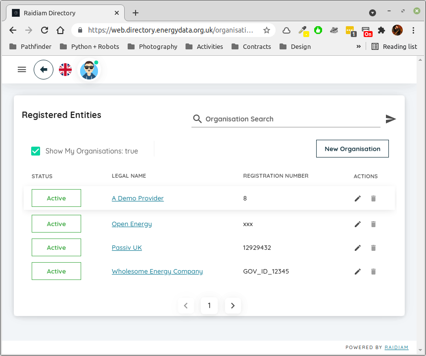
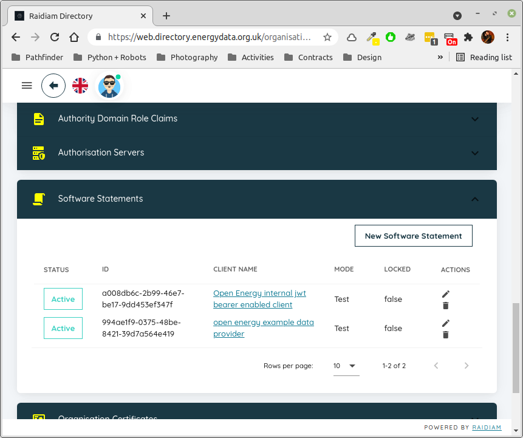
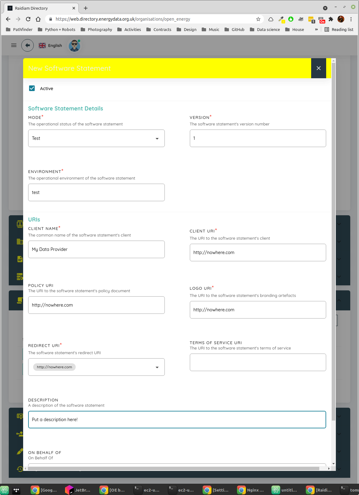
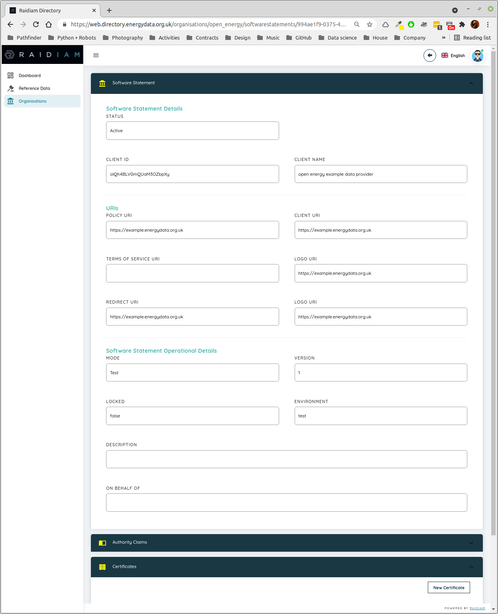
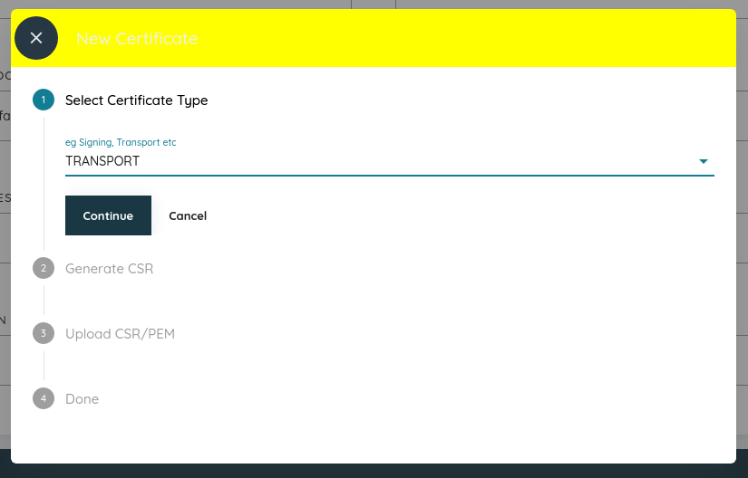
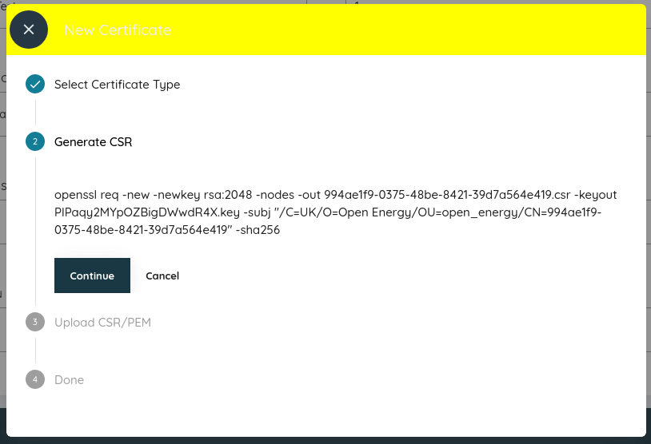
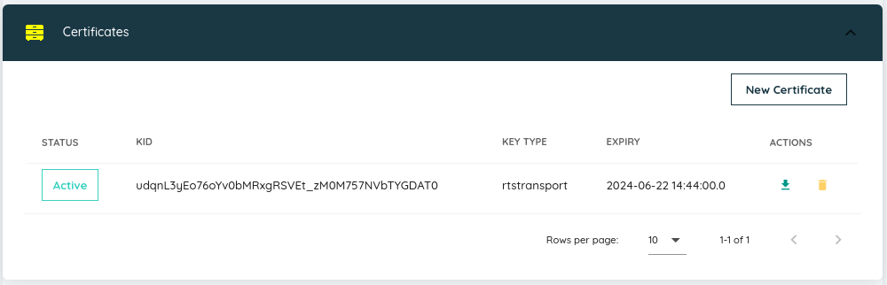

Deploying a Data Provider to EC2
================================

This guide will show you how to create and deploy a production-grade :term:`data provider` to a fresh Amazon
`EC2 <https://aws.amazon.com/ec2>`_ instance. By the end of the guide you will have a publicly visible server able to
publish shared data, secured by the |FAPI| specification as required by Open Energy.

Throughout this guide the domain ``example.energydata.org.uk`` is used - obviously you should change this to your own
domain when you see it, bear in mind that it appears in filenames as well as in the contents of some of the
configuration files themselves!

.. note::

    Before proceeding, ensure you have the following:

    1. An EC2 instance configured with Amazon Linux and a static IP address
    2. The ability to log into this instance with SSH as a user able to run ``sudo``
    3. Appropriately configured access to ports 80 and 443 on this server
    4. An account on the Open Energy Directory associated with an organisation
    5. A domain name which you control with sufficient access to add ``A`` records
    6. Approximately four hours of time and some coffee or other beverage of your choice

Installing Python 3.9
---------------------

Copied from a tutorial `here <https://tecadmin.net/install-python-3-9-on-amazon-linux/>`_, the following commands will
install any missing prerequisites then install Python 3.9 to replace the default 3.7 included in Amazon Linux. This
takes a few minutes, and ends up with an executable for ``python3.9`` added to the path, but does not replace the
default Python 2 or 3.

.. code-block:: bash

    > sudo yum install gcc openssl-devel bzip2-devel libffi-devel
    > cd /opt
    > sudo wget https://www.python.org/ftp/python/3.9.4/Python-3.9.4.tgz
    > sudo tar xzf Python-3.9.4.tgz
    > cd Python-3.9.4
    > sudo ./configure --enable-optimizations
    > sudo make altinstall

All Python code, including the ``gunicorn`` WSGI container, will run from a virtual environment created in the
``ec2-user`` home directory. Create the environment, activate it, install the necessary libraries, and fetch missing
root certificates used by the directory - these are necessary for nginx to correctly validate the presented client
certificates:

.. code-block:: bash

    > cd ~
    > python3.9 -m venv venv --upgrade-deps
    > source ./venv/bin/activate
    > pip install ib1.openenergy.support
    > oe_install_cacerts

Installing Nginx
----------------

Nginx can be installed as an Amazon extra:

.. code-block:: bash

    > sudo amazon-linux-extras install nginx1

Installing and configuring Certbot
----------------------------------

Run the following commands to set up the necessary prerequisites and install the certbot configurations to work with
Nginx:

.. code-block:: bash

    > sudo wget -r --no-parent -A 'epel-release-*.rpm' https://dl.fedoraproject.org/pub/epel/7/x86_64/Packages/e/
    > sudo rpm -Uvh dl.fedoraproject.org/pub/epel/7/x86_64/Packages/e/epel-release-*.rpm
    > sudo yum-config-manager --enable epel*
    > sudo yum install -y certbot python2-certbot-nginx

.. note::

    To proceed beyond this point you must have pointed your desired domain name at the static IP address of your EC2
    instance, and any DNS changes must have propagated through the system. You can verify this with tools like
    ``nslookup`` or ``ping``.

Initial Nginx configuration
###########################

Create a new file, ``/etc/nginx/conf.d/example.energydata.org.uk.conf``, with the following contents:

.. literalinclude:: ec2/example.energydata.org.uk.initial.conf
    :caption: /etc/nginx/conf.d/example.energydata.org.uk.conf - initial setup

Restart Nginx to pick up the configuration you just added:

.. code-block::

    > sudo systemctl restart nginx

Certbot
#######

Activate the `Certbot <https://certbot.eff.org/>`_ to get your free `Let's Encrypt <https://letsencrypt.org/>`_ certificate:

.. code-block::

    > sudo certbot --nginx -d example.energydata.org.uk

This will ask you for an email address to which urgent notifications will be sent pertaining to certificate expiry etc,
and request that you confirm acceptance of the terms and conditions, as well as checking for opt-in to mailing lists
and similar which you can ignore or not as you prefer.

You should see a message indicating success. This process will also have modified the Nginx config you created earlier
to add the necessary configuration to *use* this new certificate, you can confirm this with
``less /etc/nginx/conf.d/example.energydata.org.uk.conf`` or by loading it into an editor to inspect the changes.

.. note::

    You may wish to add a cron rule at this point to check for certificate expiry and automatically renew the
    certificate - these are relatively short-lived and a certificate expiring will bring your service down. See
    the `Automated Renewals <https://certbot.eff.org/docs/using.html?highlight=cron#automated-renewals>`_ section
    of the Certbot docs for more details.

Final Nginx configuration
#########################

The modified configuration created by the Certbot is sufficient to expose an SSL enabled HTTP server, but we have to add
some extra information before it will correctly pass through client certificates to our data provider. Edit the file and
change it to the following:

.. literalinclude:: ec2/example.energydata.org.uk.conf
    :caption: /etc/nginx/conf.d/example.energydata.org.uk.conf - final state
    :emphasize-lines: 8-15

.. note::

    The lines highlighted in yellow above are from the Certbot process, yours will, and should, be different! In general
    you will need to change any reference to ``example.energydata.org.uk`` to your own domain.

This configuration does a few things.

1. It configures an SSL server listening on port 443 (the default for HTTPS)
2. It sets up client certificate validation and makes this mandatory - all connections on port 443 *must* present a
   client certificate. This is exactly what you want for a server, the sole role of which is to serve a shared data API,
   but you may want to configure this differently if you also want to serve content to web browsers rather than API
   clients. See the `Nginx docs <http://nginx.org/en/docs/http/ngx_http_ssl_module.html#ssl_verify_client>`_ for more
   information
3. In order to provide your application with access to the client certificates presented by :term:`data consumer`
   clients, it pushes any such client certificate into a header ``X-OE-CLIENT-CERT``
4. It attempts to serve static content from ``/home/ec2-user/public``, and falls back to your data provider application
   if the specified content does not exist, accessing the application through a UNIX socket

Restart Nginx to pick up these extra changes:

.. code-block:: bash

    > sudo systemctl restart nginx

Generating key material using the directory
-------------------------------------------

The certificate created by Certbot is used by the server part of the data provider. There is a second set of key
material required, however, for the data provider to connect to the Open Energy authorisation server when validating
tokens. To create these keys you will need to log into the directory `here <https://web.directory.energydata.org.uk/>`_.

.. note::

    This requires you to have administrator access to an organisation within the directory. If you are part of our beta
    programme you should have this, if not please contact us and let us know your details and the details of the
    organisation on who's behalf you should be able to act.

Select your organisation
########################

    Select your organisation, typically if you check the box at the top of the page you will only see the single one
    to which you have access.

Create a software statement
###########################

    With the organisation selected, scroll down to the ``Software Statements`` section. Click on it to open the section,
    in this case there are two existing ones but you wouldn't expect to have any if this is the first time you've done
    this. Click on the ``New Software Statement`` box to create one.

    Populate the fields here to create a software statement.

    * Set MODE to ``Test``
    * Set VERSION to ``1``
    * Set ENVIRONMENT to ``test``
    * Set a suitably descriptive value for CLIENT NAME and DESCRIPTION
    * It doesn't matter what URI / URL you put in the other fields, but you have to put something in. The example
      here is as good a choice as any - because of how we use the directory these have no actual effect on anything.

    Scroll down and click on the button to save your software statement.

Create a certificate
####################

    Make a note of the ``CLIENT ID`` value now shown, you'll need this later when setting up your data provider code.
    Scroll down if needed until the ``Certificates`` section is visible and click on it to expand it. Click on the
    ``New Certificate`` button.

    Select TRANSPORT as the certificate type and click ``Continue``

    The text shown here is a linux command which will generate a private key (which should never leave your server) and
    a CSR, or certificate signing request, which you will need to upload in the next step. This command needs to be run
    on your EC2 instance, it does not require ``sudo`` but must be run exactly as shown.

    When run, it will generate a ``.key`` and ``.csr`` file with unreasonably long names. You will need to upload the
    CSR file in the next step, so copy it off your EC2 instance to your local desktop using ``scp``. Click ``Continue``

.. figure:: ec2/directory_7.png

    Upload the ``.csr`` file you copied off the EC2 instance here and click ``Continue``.

    You should now see your newly minted certificate. Use the small green arrow on the right to download the certificate
    itself, and use whatever mechanism you prefer to copy it across to your EC2 instance.

    .. note::

        If you are running linux on your local machine it might be simpler to do all the key generation locally and then
        copy both the private key and the certificate across to your EC2 instance - you don't need the CSR file after
        this initial setup process.

Rename your key and certificate
###############################

To avoid having to continually type extremely long semi-random filenames, I prefer to rename the ``.key`` and ``.pem``
files you should now have on your EC2 home directory. The rest of this guide assumes you have placed both these files
in a directory ``/home/ec2-user/certs`` and renamed them ``a.key`` and ``a.pem`` respectively. These filenames are
referenced from the data provider code you will create in the final section of this guide, so if you haven't done this
you will need to make the corresponding changes there.

Installing gunicorn and your Data Provider
------------------------------------------

The data provider code uses the virtual environment defined previously. The only remaining tasks are to create the
necessary configuration for gunicorn and to provide the actual data provider implementation as a Flask app.

gunicorn configuration
######################

Create a file ``/home/ec2-user/gunicorn.conf.py``:

.. literalinclude:: ec2/gunicorn.conf.py
    :caption: /home/ec2-user/gunicorn.conf.py

The only critical line here is the ``bind`` command, which tells gunicorn that we want it to listen to the UNIX socket
we previously configured Nginx to use.

gunicorn service
################

To run gunicorn as a service, and to have that service automatically start up when requests are received, you need to
create two files in ``/etc/systemd/system``:

.. literalinclude:: ec2/gunicorn.service
    :caption: /etc/systemd/system/gunicorn.service

.. literalinclude:: ec2/gunicorn.socket
    :caption: /etc/systemd/system/gunicorn.socket

There's nothing in either of these files specific to ``example.energydata.org.uk`` so create them exactly as shown
above. To enable and start the socket run the following command:

.. code-block:: bash

    > sudo systemctl enable --now gunicorn.socket

Data Provider code
##################

Finally, you need to provide the (very small!) piece of code which defines the data provider itself. Create a file
``/home/ec2-user/data_provider.py`` with the following contents:

.. literalinclude:: ec2/data_provider.py
    :caption: /home/ec2-user/data_provider.py

This particular data provider implementation is very simple, it defines a single route which takes the name of a
data file to be located in the ``shared_data`` directory, adds ``.csv`` to the filename and returns it. In the process
of doing this, however, the validator configured in the first part of the file will kick in and ensure that the client
making the request has presented both a valid client certificate and a valid access token.

Add some data
#############

A data provider without data is a sad thing indeed. The code expects CSV files in a directory
``/home/ec2-user/shared_data`` along with any static content you wish to share (although see previous sections about
enabling SSL without client certificates!) in ``/home/ec2-user/public``. Create the directories:

.. code-block::

    > cd ~
    > mkdir public shared_data

Put data of your choice in the ``shared_data`` folder. In our case we have:

.. code-block::

    (venv) [ec2-user@ip-172-31-16-197 ~]$ ls shared_data/
    tidy_DYTS01_CO2.csv  tidy_DYTS01_kWh.csv  tidy_DYTS02_kWh.csv

These will be available at ``https://example.energydata.org.uk/tidy_DYTS01_CO2`` and so on, note that the code adds the
``.csv`` part to the file name when fetching it. In practice, it's likely your data provider will be more complex than
something which simply returns a file, but that should be a question of creating additional routes in the Flask
application, no changes are required elsewhere.

Restarting the server after changes
###################################

Any changes to the data provider code may require a restart, to be safe run:

.. code-block:: bash

    > sudo systemctl restart gunicorn

Logging and monitoring
----------------------

As both gunicorn and Nginx are managed by systemd, you can use the regular tools to view logs, check status, stop and
restart services etc as needed. In particular it's useful to have a live view on the logs from your data provider, and
you can do this with

.. code-block:: bash

    > journalctl -u gunicorn -f

This will keep watching the application logs for changes and provide a rolling view of activity. Full use of systemd and
its associated monitoring capabilities is outside of the scope of this guide however!

Coffee
------

If you've made it this far you've earned it...