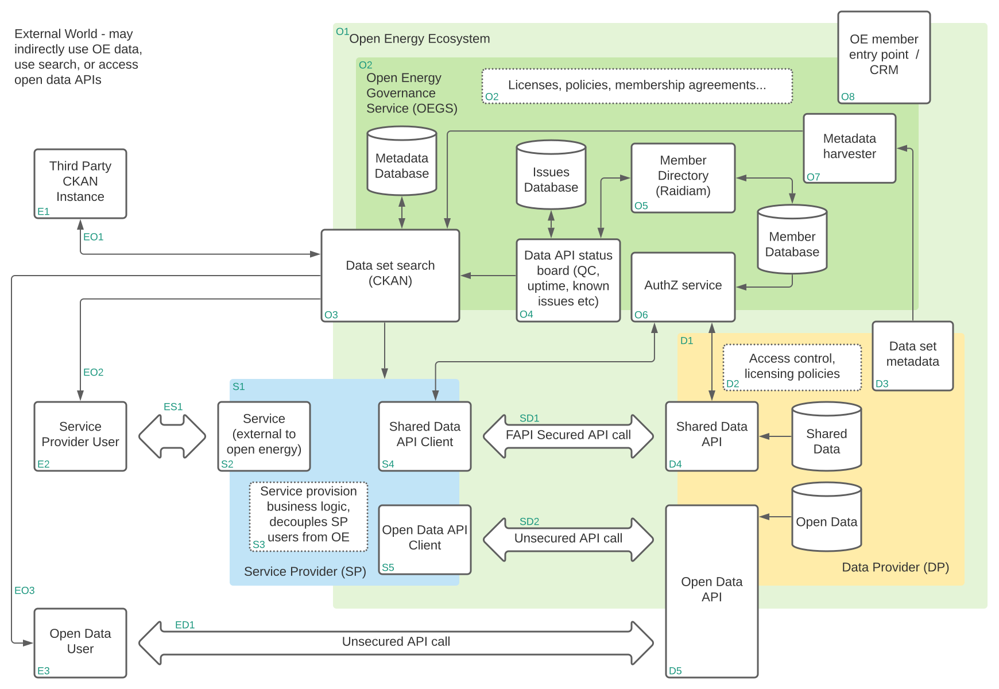

Open Energy Infrastructure Support
==================================

This library contains Python 3.8 functions and classes you can use when building `Open Energy`_ Data and Service
Providers (|DP| & |SP|). See `github`_ for source code.

Interacting with the |OE3| :term:`authorization` and :term:`authentication` services as either a consumer or provider of
information has some degree of complexity - this library exists to handle these concerns, leaving you to write the
business logic without having to manage the details of token management etc.

Code in this library is licensed under the `MIT license <https://opensource.org/licenses/MIT>`_ . Documentation
(including this site) is licensed under `CC BY 4.0 <https://creativecommons.org/licenses/by/4.0/>`_.

Contents
--------

.. toctree::
    :maxdepth: 4
    :glob:

    installation
    service_provider
    data_provider
    ssl_dev
    api

Open Energy Phase 3
-------------------

.. note::
    For definitive information about the Open Energy project, please visit us at https://energydata.org.uk/ - the
    information presented here is specific to the functions of this library and will not explain the wider |OE3|
    ecosystem.

    Open Energy Map

Library Scope
#############

:numref:`map_image` above shows the entire Open Energy ecosystem. This library is limited in scope to two elements of
the overall architecture:

1. The *Shared Data API Client* held within the *Service Provider* (|SP|)
2. The *Shared Data API* held within the *Data Provider* (|DP|)

Depending on your role in the system, you may need to implement either or both of these in your code.

If you are building an internal or customer facing tool to access, present, or analyse, shared energy data, you would
need to access secure data APIs through the first of these. See `accessing oe shared data`

If you have shared energy data and need to share it with other participants in a secure manner within the ecosystem, you
will need to implement an appropriately secured shared data API. See `providing oe shared data`

.. note::
    As an aside, it is entirely possible that you are building a system which will act both as a |SP| and as a |DP|, for
    example a system which aggregates information from multiple data sources and then publishes that processed data set
    as a |DP| in its own right.

.. _github: https://github.com/icebreakerone/open-energy-python-infrastructure
.. _Open Energy: https://energydata.org.uk/